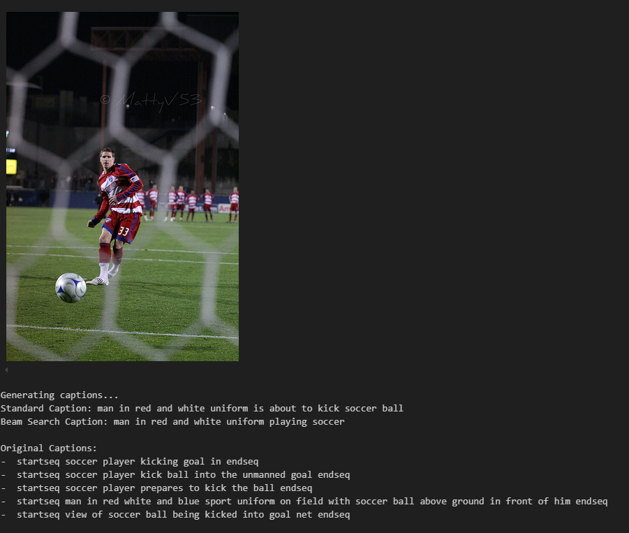
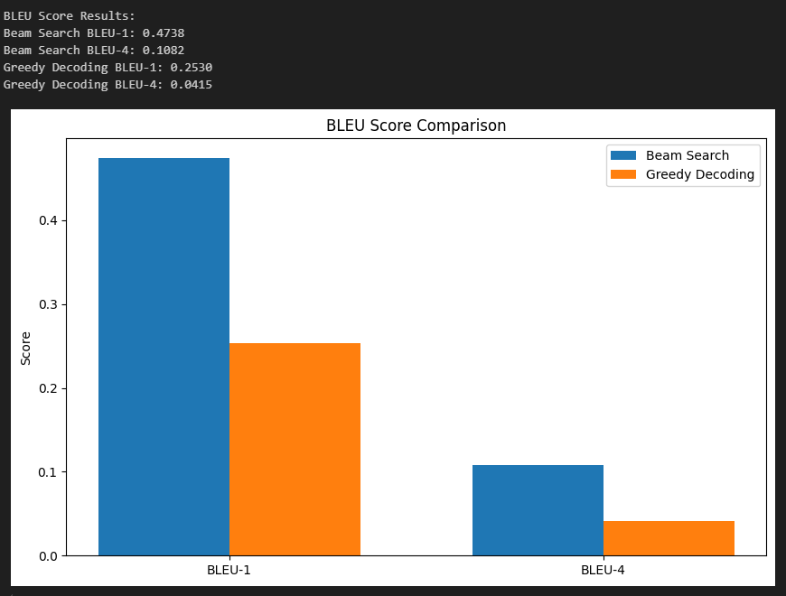

# Image Captioning with TensorFlow

Generate captions for any image using the Flickr8k dataset with a Bahdanau attention-based neural network and VGG16 for image feature extraction

## Features

- Efficient data processing with tf.data.Dataset
- Transfer learning with VGG16 for image feature extraction
- Attention mechanism for focusing on relevant image parts
- Caption generation using both greedy and beam search
- Comprehensive evaluation metrics including BLEU scores

## Model Architecture

The model uses a hybrid CNN-RNN architecture:

1. **Image Encoder**: Pre-trained VGG16 to extract (7,7,512) shaped feature vectors from images
2. **Attention Mechanism**: Allows the model to focus on relevant parts of the image for each word
3. **Text Decoder**: GRU network with embedding layer and attention to generate captions word by word

## Training and Evaluation

The model is trained using:
- Cross-entropy loss
- Adam optimizer with learning rate decay
- Early stopping to prevent overfitting

Evaluation metrics include:
- BLEU scores (BLEU-1 and BLEU-4) for both Greedy and Beam search caption generation
- Accuracy and loss values

## Sample caption generation example

## BLEU Scores

